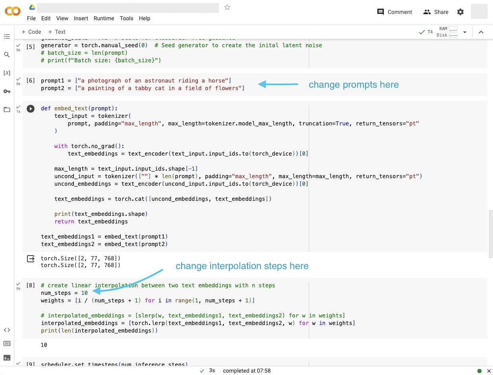
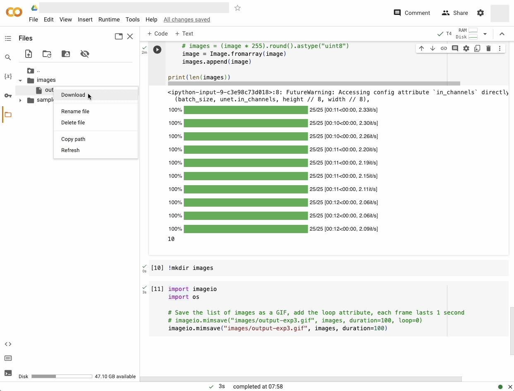

# Stable Diffusion Interpolate Gif | Jupyter Notebook

Create an interpolated gif using a Stable Diffusion on a Jupyter Notebook for free on Google Colab. This specific set of packages has to be used to get everything working. No coding is required. The notebook was last tested on Google Colab 2023-11-10.

## Instructions

- Upload `deconstruct_diffusion-fixed_versions.ipynb` onto [Google Colab](https://colab.research.google.com/)
- Run the notebook on T4 GPU
  - 'Runtime' > 'Change runtime type' > 'Hardware accelerate' > Select 'T4 GPU'
- Change start & end prompts and the number of interpolation steps (see Figure 1 below)
- Run the cells
- Download the exported gif (see Figure 2 below)

**Figure 1: Change start & end prompts and the number of interpolation steps**

**Figure 2: Download the exported gif**

## Acknowledgments

Code adapted from [Hugging Face Diffusers documentation](https://huggingface.co/docs/diffusers/using-diffusers/write_own_pipeline)
